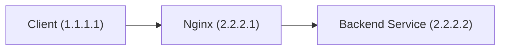
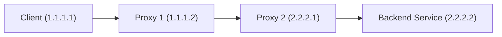
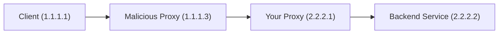

在使用 Nginx 作为反向代理时，后端服务获取到的客户端 IP 地址常常不准确，这会影响日志记录、访问控制和数据分析等功能。本文将深入探讨这一问题，并提供一套完整、安全的解决方案。

## 场景一：单层反向代理

最常见的拓扑结构如下，客户端通过 Nginx 访问后端的服务。



在这种情况下，由于后端服务直接与 Nginx 通信，它从网络连接中获取到的 IP 地址是 Nginx 的 IP `2.2.2.1`，而非客户端的真实 IP `1.1.1.1`。

### 解决方案：`X-Real-IP`

为了解决这个问题，我们需要修改 Nginx 配置，让它在转发请求时，通过一个自定义的 HTTP Header 来传递真实 IP。最常见的 Header 是 `X-Real-IP`。

在 `location` 块中添加以下配置：

```nginx
location / {
    proxy_set_header X-Real-IP $remote_addr;
    # ... other configurations
}
```

- `$remote_addr` 是 Nginx 的一个变量，它保存了与 Nginx 建立连接的客户端 IP。在此场景下，它的值就是 `1.1.1.1`。

配置完成后，Nginx 会在请求头中增加 `X-Real-IP: 1.1.1.1`，并将其转发给后端服务。后端服务只需读取这个 Header，就能获取到客户端的真实 IP。

> **注意**：后端应用框架可能需要额外配置才能识别并信任 `X-Real-IP` Header。

## 场景二：多层反向代理

在更复杂的架构中，可能存在多层代理，例如：



此时，对于 Nginx2 而言，它的 `$remote_addr` 是上一级代理 Nginx1 的 IP `1.1.1.2`。如果仍然只使用 `X-Real-IP: $remote_addr`，后端服务获取到的 IP 将是 `1.1.1.2`，这依然是错误的。

### 解决方案：`X-Forwarded-For` 与 `real_ip` 模块

`X-Forwarded-For` (XFF) 是一个业界标准，用于记录请求经过的代理服务器 IP 链。一个典型的 XFF Header 看起来像这样：`X-Forwarded-For: <client>, <proxy1>, <proxy2>, ...`

我们需要在每一层 Nginx 代理上都配置 XFF：

```nginx
# On Nginx1 and Nginx2
proxy_set_header X-Forwarded-For $proxy_add_x_forwarded_for;
```

- `$proxy_add_x_forwarded_for` 变量会自动处理 XFF Header。它会获取上游传递过来的 XFF Header，并在末尾追加当前代理的 `$remote_addr`。

经过上述配置后，当请求到达 Nginx2 时，它收到的 XFF Header 是 `1.1.1.1`。Nginx2 处理后，传递给后端服务的 XFF Header 将是 `1.1.1.1, 1.1.1.2`。

虽然 IP 链有了，但 Nginx2 自身的 `$remote_addr` 仍然是 `1.1.1.2`。为了让 Nginx2 能自动识别出真实的客户端 IP，我们需要使用 `ngx_http_realip_module` 模块。

在 Nginx2 的 `http` 或 `server` 块中添加配置：

```nginx
# On Nginx2
real_ip_header X-Forwarded-For;
real_ip_recursive on;
```

- `real_ip_header X-Forwarded-For;`: 指示 Nginx 从 `X-Forwarded-For` Header 中解析真实 IP。当配置生效后，Nginx 会用解析出的 IP 来覆盖自身的 `$remote_addr` 变量。
- `real_ip_recursive on;`: 启用递归解析。Nginx 会从 XFF 列表的 **末尾** 开始，逐个检查 IP。如果 IP 属于可信代理（通过 `set_real_ip_from` 定义），则继续向前查找，直到找到第一个 **非可信** 的 IP，并将其视为最终的真实客户端 IP。

## 场景三：防范 IP 伪造

如果攻击者可以绕过最外层代理，或者最外层代理本身是恶意的，就可能伪造 XFF Header。



假设这个恶意代理发送了一个伪造的 Header：`X-Forwarded-For: 10.10.10.10, 1.1.1.1`。
当请求到达 Nginx2 时，Nginx2 会将自己的 `$remote_addr`（即 `1.1.1.3`）追加到末尾，形成 `X-Forwarded-For: 10.10.10.10, 1.1.1.1, 1.1.1.3`。

如果没有正确配置信任列表，`real_ip_recursive` 会一直向前追溯，最终将伪造的 `10.10.10.10` 作为真实 IP，这可能导致严重的安全问题（如绕过 IP 黑名单）。

### 解决方案：`set_real_ip_from`

`set_real_ip_from` 指令用于定义可信代理的 IP 地址或 CIDR 网段。只有来自这些可信代理的请求，Nginx 才会执行 `real_ip_recursive` 的递归查找逻辑。

```nginx
# On Nginx2
set_real_ip_from 1.1.1.2; # 假设 Nginx1 是唯一的可信上游代理
# set_real_ip_from 192.168.1.0/24; # 也可以是一个网段

real_ip_header X-Forwarded-For;
real_ip_recursive on;
```

配置后，当 Nginx2 收到来自 `1.1.1.3` 的请求时：

1.  Nginx2 检查请求来源 `1.1.1.3` 是否在 `set_real_ip_from` 定义的信任列表中。
2.  发现不匹配，处理流程终止。
3.  Nginx 不再解析 XFF Header，而是直接使用物理连接的 IP，即 `1.1.1.3` 作为 `$remote_addr`。

这样，后端服务获取到的 IP 将是 `1.1.1.3`。虽然这也不是最初的客户端 IP，但它是流量的真实来源，我们可以基于这个 IP 进行安全分析和封禁，有效避免了 IP 欺骗。

## 最终推荐配置

一个健壮、安全的 Nginx 反向代理配置如下：

```nginx
http {
    # --- Real IP Configuration ---
    # 填写所有你信任的上游代理服务器的IP地址或CIDR。
    # 例如：你的负载均衡器、CDN、前置Nginx集群等。
    set_real_ip_from 172.16.0.0/12;
    set_real_ip_from 192.168.0.0/16;
    # 警告：切勿在生产环境中使用 0.0.0.0/0，因为它会信任所有来源，使IP伪造成为可能。

    real_ip_header X-Forwarded-For;
    real_ip_recursive on;

    # ... other http configurations

    server {
        listen 80;
        server_name _;

        location / {
            # 将解析出的真实IP ($remote_addr) 赋值给 X-Real-IP
            proxy_set_header X-Real-IP $remote_addr;

            # 持续传递IP链
            proxy_set_header X-Forwarded-For $proxy_add_x_forwarded_for;

            proxy_set_header Host $host;
            proxy_pass http://backend.service:8080;
        }
    }
}
```

通过这套配置，你可以确保无论代理架构多么复杂，后端服务总能安全、准确地获取到客户端的真实 IP 地址。
