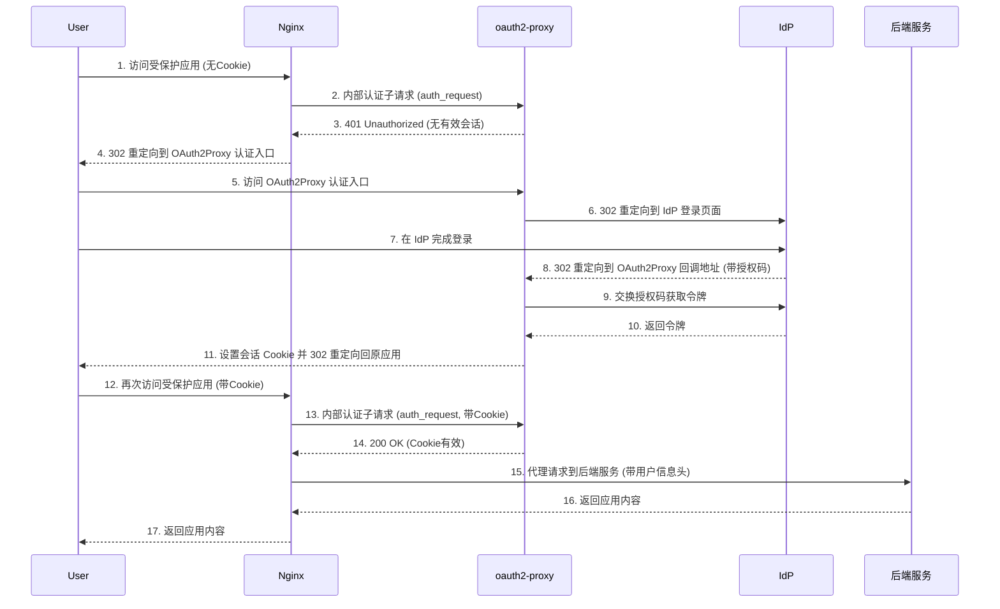

# NGINX OIDC 认证集成指南

## 一. 概述

本文档旨在提供一份清晰的通用指南，说明如何为现有的 Nginx 站点快速、高效地集成基于 OpenID Connect (OIDC) 的统一认证功能。我们通过引入 `oauth2-proxy` 作为认证中间件，实现了 Nginx 与身份提供商 (IdP) 的解耦，使得认证过程对现有 Nginx 配置的侵入性降到最低。

## 二. 架构说明

本认证方案的核心由以下三个组件协同工作：

- **Nginx (认证网关)**: 作为所有外部流量的入口。它负责拦截用户请求，并通过 `auth_request` 模块将认证任务委托给 `oauth2-proxy`。认证成功后，Nginx 才将请求代理到原始的后端服务。
- **oauth2-proxy**: 作为 OIDC 客户端。它负责与 IdP 进行 OIDC 协议交互（如授权码流程），管理用户的会話 Cookie，并根据认证结果响应 Nginx 的 `auth_request`。
- **身份提供商 (IdP)**: 例如 Logto, Keycloak, Okta 等。它负责处理用户的登录、注册、多因素认证等身份验证流程，并向 `oauth2-proxy` 提供身份令牌。

**认证流程简述：**



1.  用户首次访问受保护的应用 `https://app.your-domain.com`。
2.  Nginx 拦截请求，通过 `auth_request` 发现用户未认证，向 `oauth2-proxy` 发送一个内部认证子请求。
3.  `oauth2-proxy` 发现用户没有有效的会话 Cookie，返回 `401 Unauthorized`。
4.  Nginx 收到 `401`，根据预设规则将用户浏览器重定向到 `oauth2-proxy` 的认证入口，例如 `https://oauth2proxy.your-domain.com/oauth2/start`。
5.  `oauth2-proxy` 接管请求，将用户重定向到 IdP 的登录页面。
6.  用户在 IdP 完成登录。
7.  IdP 将用户重定向回 `oauth2-proxy` 的回调地址，例如 `https://oauth2proxy.your-domain.com/oauth2/callback`。
8.  `oauth2-proxy` 处理回调，通过授权码换取令牌，验证身份，并为用户设置一个加密的会话 Cookie (`_oauth2_proxy`)，其作用域通常是主域名。
9.  `oauth2-proxy` 将用户重定向回最初访问的应用 `https://app.your-domain.com`。
10. 浏览器再次访问应用，此时请求会携带 `_oauth2_proxy` Cookie。
11. Nginx 再次通过 `auth_request` 向 `oauth2-proxy` 发送认证子请求。
12. `oauth2-proxy` 验证 Cookie 有效，返回 `200 OK`。
13. Nginx 收到 `200`，认证通过，将请求代理到原始的后端服务。

## 三. 配置 Nginx

为实现认证，我们需要配置 Nginx 完成两项任务：为 `oauth2-proxy` 服务本身提供反向代理，以及为需要保护的应用开启认证。

### 步骤一：为 `oauth2-proxy` 配置反向代理

首先，我们需要让 `oauth2-proxy` 服务可以通过域名（例如 `oauth2proxy.your-domain.com`）被外部访问。

**示例: `/etc/nginx/sites-available/oauth2proxy.conf`**

```nginx
server {
    listen 443 ssl http2;
    server_name oauth2proxy.your-domain.com;

    # SSL 配置 (请替换为您的证书路径)
    ssl_certificate /path/to/your/fullchain.pem;
    ssl_certificate_key /path/to/your/privkey.pem;
    # ... 其他推荐的 SSL 配置 ...

    location / {
        proxy_pass http://127.0.0.1:4180;
        proxy_set_header Host $host;
        proxy_set_header X-Real-IP $remote_addr;
        proxy_set_header X-Scheme $scheme;
        proxy_set_header X-Auth-Request-Redirect $request_uri;
    }
}
```

### 步骤二：为应用站点启用认证

接下来，修改您需要保护的应用的 Nginx 配置，让它利用 `oauth2-proxy` 进行认证。

**1. 创建通用认证逻辑片段**

为了便于复用，我们将认证逻辑提取到一个单独的文件中。

**文件: `/etc/nginx/snippets/oauth2-proxy.include`**

```nginx
# 认证请求将发送到 oauth2-proxy 服务
auth_request /oauth2/auth;

# 从认证成功的响应中提取用户信息并设置为变量
auth_request_set $user $upstream_http_x_auth_request_user;
auth_request_set $email $upstream_http_x_auth_request_email;

# 当认证失败 (401) 时，重定向到 oauth2-proxy 的登录入口
error_page 401 = @oauth2_login;

location @oauth2_login {
    # $request_uri 会被编码后作为 rd 参数，认证成功后会重定向回来
    return 302 https://oauth2proxy.your-domain.com/oauth2/start?rd=$request_uri;
}

# 内部 location，用于将认证请求代理到 oauth2-proxy
location = /oauth2/auth {
    internal;
    proxy_pass http://127.0.0.1:4180;
    proxy_set_header Host $host;
    proxy_set_header Content-Length "";
    proxy_set_header X-Original-URI $request_uri;
}
```

**2. 在应用配置中引入认证逻辑**

现在，在您应用的 `server` 块中引入上面的文件。

**示例: `/etc/nginx/sites-available/your-app.conf`**

```nginx
server {
    listen 443 ssl http2;
    server_name app.your-domain.com;

    # SSL 配置
    ssl_certificate /path/to/your/fullchain.pem;
    ssl_certificate_key /path/to/your/privkey.pem;

    # --- OIDC 认证集成 ---
    include /etc/nginx/snippets/oauth2-proxy.include;
    # --- 集成结束 ---

    location / {
        proxy_pass http://your_backend_service;
        proxy_set_header Host $host;
        # 可以将认证后的用户信息传递给后端
        proxy_set_header X-User-ID $user;
        proxy_set_header X-User-Email $email;
    }
}
```

### 步骤三：重载 Nginx 配置

检查配置语法并重新加载 Nginx 使其生效。

```bash
nginx -t
sudo systemctl reload nginx
```

## 四. 部署 `oauth2-proxy`

> **配置方式说明**: `oauth2-proxy` 支持通过配置文件、环境变量或命令行参数进行配置。三者的加载优先级为：**命令行参数 > 环境变量 > 配置文件**。为便于集中管理和维护，本文推荐使用配置文件 (`.cfg`) 的方式。

### `docker-compose.yml` 示例

此文件用于启动 `oauth2-proxy` 服务，并挂载配置文件。

**文件: `/opt/oauth2proxy/docker-compose.yml`**

```yaml
version: "3.8"
services:
  oauth2-proxy:
    image: quay.io/oauth2-proxy/oauth2-proxy:latest
    container_name: oauth2_proxy
    ports:
      # 建议仅监听本地回环地址，通过 Nginx 暴露到外部
      - "127.0.0.1:4180:4180"
    command:
      # 指定配置文件的路径
      - "--config=/etc/oauth2-proxy/oauth2-proxy.cfg"
    volumes:
      # 将本地配置文件挂载到容器内
      - ./oauth2-proxy.cfg:/etc/oauth2-proxy/oauth2-proxy.cfg:ro
    restart: always
```

### `oauth2-proxy.cfg` 示例

这是 `oauth2-proxy` 的核心配置文件。

**文件: `/opt/oauth2proxy/oauth2-proxy.cfg`**

```ini
# OIDC 提供商的 Issuer URL
# oauth2-proxy 会通过此地址自动发现 OIDC 配置
# 例如: https://your-idp.com/oidc
oidc_issuer_url = "YOUR_OIDC_ISSUER_URL"

# 在 IdP 注册应用后获得的客户端凭据
client_id = "YOUR_CLIENT_ID"
client_secret = "YOUR_CLIENT_SECRET"

# 用于加密会话 Cookie 的密钥 (必须修改)
# !! 使用 `openssl rand -base64 32` 生成一个新的强密钥
cookie_secret = "CHANGE_ME_PLEASE_!!!!!!!!!!!!!!!!"

# Cookie 的有效域名。设置为顶级域名（前面带点），
# 以便所有子域名（app.your-domain.com）都可以共享登录状态。
cookie_domain = ".your-domain.com"

# 允许登录的 Email 域名。设置为 "*" 表示允许任何 email 地址。
email_domains = "*"

# OIDC 认证成功后的回调 URL
# 必须与 IdP 应用配置中的回调地址完全一致
redirect_url = "https://oauth2proxy.your-domain.com/oauth2/callback"

# 服务监听地址
http_address = "0.0.0.0:4180"

# 在 auth_request 模式下，认证成功后直接返回 HTTP 200
upstreams = "static://200"

# 将用户信息设置到 X-Auth-Request-* 响应头中，以便 Nginx 读取
set_xauthrequest = true

# 启用安全的 Cookie 属性
cookie_secure = true
cookie_samesite = "lax"
```

## 五. 常见问题与排查

### 问题一：认证后出现无限重定向循环？

- **原因**: 最常见的原因是 `oauth2-proxy` 设置的 `cookie_domain` 与应用域名不匹配，导致 Cookie 无法被正确发送。
- **解决方案**:
  1.  确保 `oauth2-proxy.cfg` 中的 `cookie_domain` 设置为正确的主域名，例如 `.your-domain.com`。
  2.  使用浏览器开发者工具检查 `_oauth2_proxy` Cookie 的 `Domain` 属性是否正确。

### 问题二：认证后出现 502 Bad Gateway？

- **原因**: Nginx 无法连接到 `oauth2-proxy` 服务。
- **解决方案**:
  1.  检查 `oauth2-proxy` Docker 容器是否正常运行 (`docker ps`)。
  2.  检查 Nginx 配置中 `proxy_pass` 的地址和端口（`http://127.0.0.1:4180`）是否正确无误。
  3.  检查服务器防火墙或网络策略，确保 Nginx 可以访问 `127.0.0.1:4180`。

### 问题三：IdP 登录页面报错或认证失败？

- **原因**: `oauth2-proxy` 与 IdP 之间的配置不匹配。
- **解决方案**:
  1.  仔细核对 `oauth2-proxy.cfg` 中的 `oidc_issuer_url`, `client_id`, `client_secret` 是否与 IdP 应用配置完全一致。
  2.  登录 IdP 后台，确保应用配置的“回调地址 (Redirect URI)”列表中，包含了且仅包含了 `https://oauth2proxy.your-domain.com/oauth2/callback`。

### 问题三：IdP 登录页面报错或认证失败？

- **原因**: `oauth2-proxy` 与 IdP 之间的配置不匹配。
- **解决方案**:
  1.  仔细核对 `oauth2-proxy.cfg` 中的 `oidc_issuer_url`, `client_id`, `client_secret` 是否与 IdP 应用配置完全一致。
  2.  登录 IdP 后台，确保应用配置的“回调地址 (Redirect URI)”列表中，包含了且仅包含了 `https://oauth2proxy.your-domain.com/oauth2/callback`。
